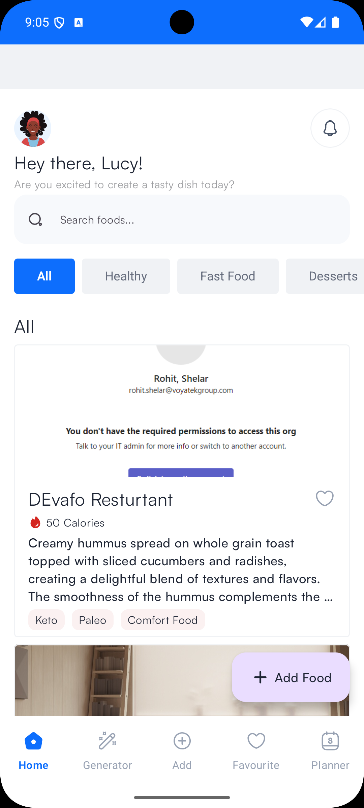
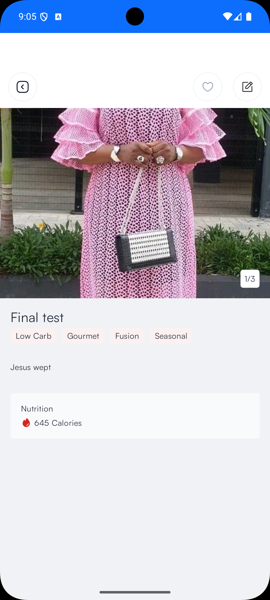
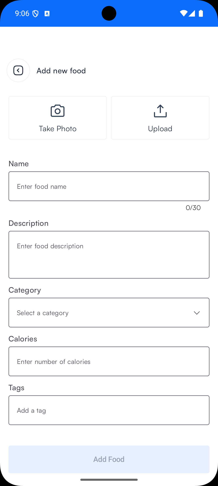

# Voyatek Food App
Android application which enables you add meals and also display the meals with filter functions.

## Screenshots

  
  
  

## Languages, libraries and tools used
* Kotlin
* Compose Navigation
* Retrofit
* KotlinX serializer
* Jetpack compose
* Hilt - dependency injection
* Compose States
* Serializable

## How to run the project
* Download the latest android studio
* Clone the project from github using this command `git clone https://github.com/davidsunday/Voyatek-food-app.git`
* Open the project in android studio
* Run the project on an emulator or a physical device

## Architecture
* This project makes use of MVVM architecture.
* The **data layer** is responsible communicating with the rest API.
* Endpoints:
  * `api/foods`: A GET request that returns a list of food
  * `api/categories`: A GET request that returns a list of meal categories.
  * `api/tags`: A GET request that returns a list of tags. There can be more than one tag for each meal
  * `api/foods`: A POST request that handles saving of meal to server
* The **ViewModel** handles the UI logic
*  **Composables** is use for UI display

